# BÁO CÁO BÀI TẬP LỚN: CÔNG NGHỆ PHẦN MỀM NÂNG CAO

**TRƯỜNG ĐẠI HỌC THỦY LỢI**  
**KHOA CÔNG NGHỆ THÔNG TIN**

---

<p align="center">
  
</p>

<h2 align="center">Bài tập lớn</h2>
<h3 align="center">Học phần: Công nghệ phần mềm nâng cao</h3>
<h3 align="center">Đề tài: Nền tảng luyện tập code trực tuyến (Luyện Tập Code)</h3>

<div align="right">
  <p><strong>Nhóm Học Viên Thực Hiện:</strong></p>
  <ul>
    <li>Đàm Văn Luận</li>
    <li>Nguyễn Thanh Tâm</li>
    <li>Hoàng Đức Dũng</li>
  </ul>
  <p><strong>Giảng viên hướng dẫn:</strong> TS. Lê Nguyễn Tuấn Thành</p>
</div>

<p align="center">Hà Nội, Tháng 3 Năm 2026</p>

---

## 1. PRODUCT BACKLOG

| ID       | User Stories                                                                                                                    | Độ ưu tiên |
| :------- | :------------------------------------------------------------------------------------------------------------------------------ | :--------- |
| **US01** | Là **học viên**, tôi muốn chọn bài tập theo cấp độ để bắt đầu luyện tập phù hợp với trình độ.                                   | 1          |
| **US02** | Là **học viên**, tôi muốn viết code và chạy thử trực tiếp trên trình duyệt để thấy kết quả ngay lập tức.                        | 1          |
| **US03** | Là **học viên**, tôi muốn nộp bài (Submit) để hệ thống tự động chấm điểm qua các bộ test case.                                  | 1          |
| **US04** | Là **học viên**, tôi muốn xem gợi ý (Hint) và mã nguồn mẫu (Solution) khi gặp khó khăn.                                         | 2          |
| **US05** | Là **quản trị viên**, tôi muốn quản lý danh sách bài tập (thêm, sửa, xóa) và các bộ test case đi kèm.                           | 1          |
| **US06** | Là **người dùng**, tôi muốn chọn ngôn ngữ lập trình (Python, C, C++, Java, C#) để thực hành.                                    | 2          |
| **US07** | Là **hệ thống**, tôi muốn cung cấp môi trường thực thi an toàn (Isolation) cho mã nguồn người dùng.                             | 1          |
| **US08** | Là **giảng viên**, tôi muốn thêm, sửa, xóa các bài giảng và xem số lượng học sinh.                                              | 2          |
| **US09** | Là **giảng viên**, tôi muốn quản lý nội dung khóa học (ví dụ: bài giảng, tài liệu, bài tập) để cập nhật thông tin cho học viên. | 2          |
| **US10** | Là **quản trị viên cấp cao**, tôi muốn toàn quyền quản lý hệ thống, bao gồm phân quyền và quản lý vai trò.                      | 1          |
| **US11** | Là **trợ giảng**, tôi muốn xem báo cáo và lịch sử nộp bài của sinh viên để hỗ trợ quá trình học tập.                            | 2          |

---

## 2. BẢNG PHÂN CHIA CÔNG VIỆC

| Nhiệm vụ                                     | Thành viên thực hiện           |
| :------------------------------------------- | :----------------------------- |
| Tài liệu đặc tả & Phân tích yêu cầu          | Đàm Văn Luận, Nguyễn Thanh Tâm |
| Thiết kế kiến trúc Backend (Flask, SocketIO) | Đàm Văn Luận                   |
| Thiết kế giao diện Frontend (Responsive UI)  | Hoàng Đức Dũng                 |
| Lập trình logic thực thi code thời gian thực | Hoàng Đức Dũng, Đàm Văn Luận   |
| Xây dựng cơ sở dữ liệu bài tập & Test cases  | Nguyễn Thanh Tâm               |
| Quản lý tài khoản & Phân quyền hệ thống      | Đàm Văn Luận, Hoàng Đức Dũng   |
| Kiểm thử hệ thống & Viết báo cáo             | Nguyễn Thanh Tâm, Đàm Văn Luận |

---

## 3. TÀI LIỆU ĐẶC TẢ YÊU CẦU

### 3.1. Sơ đồ Use Case tổng quát (5 Tác nhân)

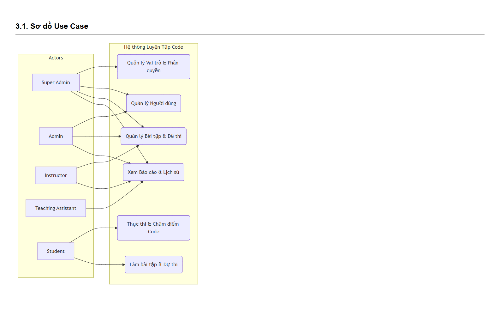

<!--
```mermaid
graph LR
    subgraph Actors
        SA[Super Admin]
        AD[Admin]
        INS[Instructor]
        TA[Teaching Assistant]
        ST[Student]
    end

    subgraph "Hệ thống Luyện Tập Code"
        UC1(Quản lý Vai trò & Phân quyền)
        UC2(Quản lý Người dùng)
        UC3(Quản lý Bài tập & Đề thi)
        UC4(Thực thi & Chấm điểm Code)
        UC5(Xem Báo cáo & Lịch sử)
        UC6(Làm bài tập & Dự thi)
    end

    SA --> UC1

    SA --> UC2
    SA --> UC3
    SA --> UC5

    AD --> UC2
    AD --> UC3
    AD --> UC5

    INS --> UC3
    INS --> UC5

    TA --> UC5

    ST --> UC4
    ST --> UC6

````
-->

### 3.2. Sơ đồ chức năng (FDD)

![Sơ đồ FDD](images/fdd_diagram.png)

<!--
```mermaid
graph TD
    A[Nền tảng Luyện Tập Code] --> B[Quản lý Bài tập]
    A --> C[Thực thi Mã nguồn]
    A --> D[Chấm điểm Tự động]

    B --> B1[Phân loại cấp độ]
    B --> B2[Quản lý Test case]

    C --> C1[Hỗ trợ đa ngôn ngữ]
    C --> C2[Input/Output thời gian thực]

    D --> D1[So khớp kết quả]
    D --> D2[Báo cáo lỗi biên dịch/runtime]
````

-->

### 3.3. Sơ đồ luồng dữ liệu (Data Flow Diagram - DFD)

#### 3.3.1. DFD Mức 0 (Context Diagram)

![DFD Mức 0](images/dfd0_diagram.png)

<!--
```mermaid
graph LR
    User((Người dùng))
    System[[Hệ thống Luyện Tập Code]]
    Admin((Quản trị viên))

    User -- "Gửi mã nguồn, yêu cầu chạy" --> System

    System -- "Kết quả thực thi, điểm số" --> User
    Admin -- "Cấu hình bài tập, test case" --> System
    System -- "Báo cáo thống kê" --> Admin

````
-->

#### 3.3.2. DFD Mức 1

![DFD Mức 1](images/dfd1_diagram.png)

<!--
```mermaid
graph TD
    U((Học viên))
    P1[Xác thực & Phân quyền]
    P2[Quản lý Bài tập]
    P3[Thực thi & Chấm điểm]
    D1[(Users DB)]
    D2[(Problems DB)]
    D3[(Submissions DB)]

    U --> P1
    P1 <--> D1
    P1 --> P2
    P2 <--> D2
    P1 --> P3
    P3 <--> D2
    P3 --> D3
    P3 -- "Kết quả" --> U
````

-->

### 3.4. Sơ đồ thực thể liên kết (ER Diagram - ERD)

![ER Diagram](images/erd_diagram.png)

<!--
```mermaid
erDiagram
    USER ||--o{ SUBMISSION : makes
    USER {
        string username PK
        string password
        string role
        string display_name
    }
    PROBLEM ||--o{ SUBMISSION : contains
    PROBLEM {
        int id PK
        string title
        string description
        string difficulty
        json test_cases
    }
    SUBMISSION {
        int id PK
        string username FK
        int problem_id FK
        string code
        string result
        datetime timestamp
    }
```

### 3.5. Sơ đồ lớp (Class Diagram)

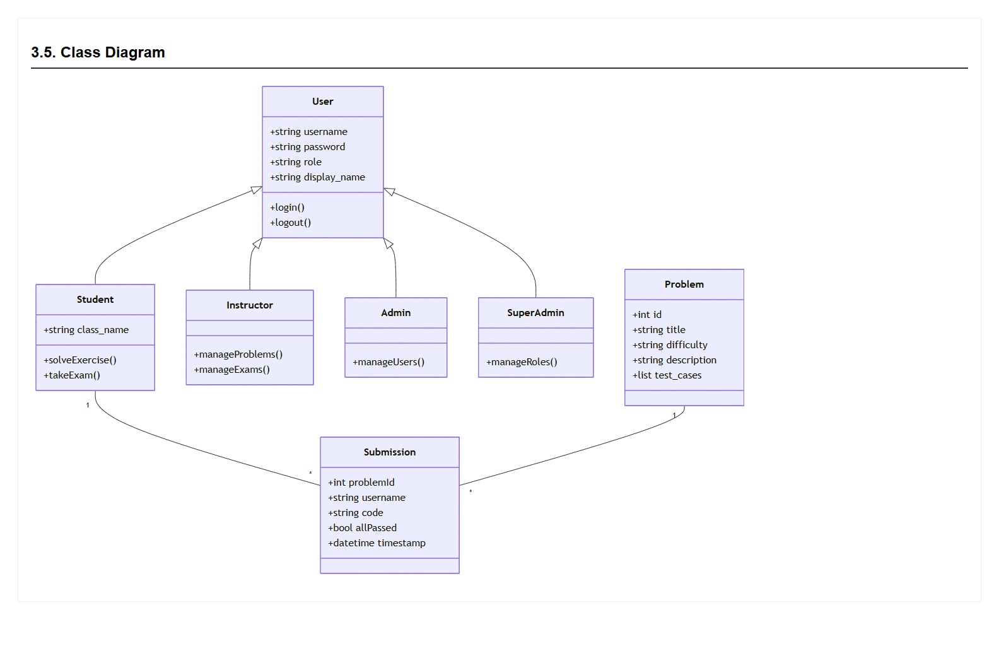

<!--
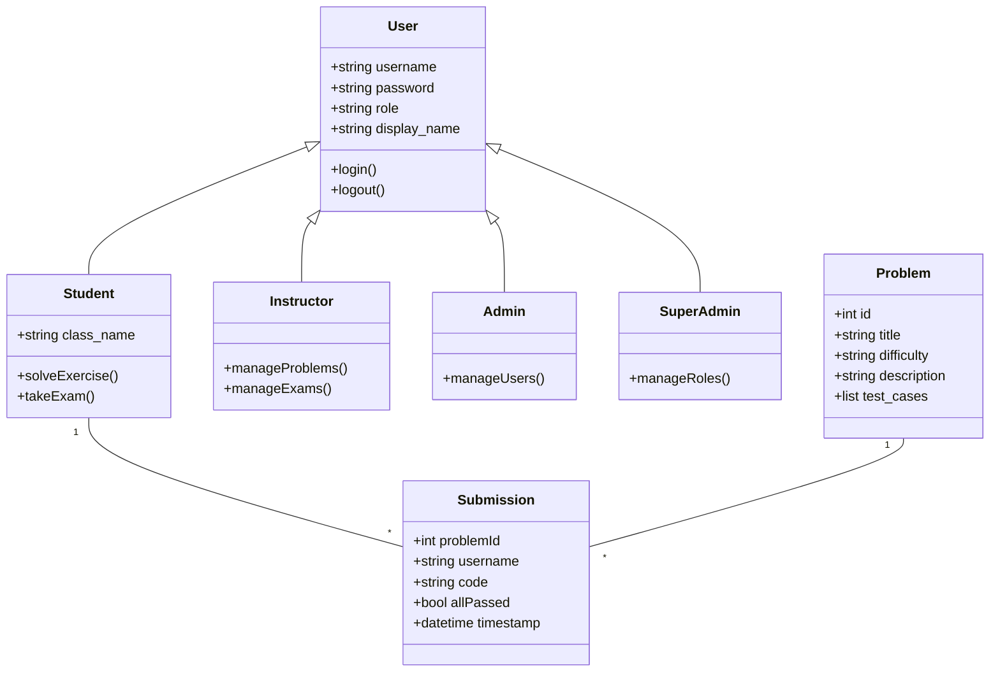
```mermaid
classDiagram
    class User {
        +string username
        +string password
        +string role
        +string display_name
        +login()
        +logout()
    }
    class Student {
        +string class_name
        +solveExercise()
        +takeExam()
    }
    class Instructor {
        +manageProblems()
        +manageExams()
    }
    class Admin {
        +manageUsers()
    }
    class SuperAdmin {
        +manageRoles()
    }
    class Problem {
        +int id
        +string title
        +string difficulty
        +string description
        +list test_cases
    }
    class Submission {
        +int problemId
        +string username
        +string code
        +bool allPassed
        +datetime timestamp
    }

    User <|-- Student
    User <|-- Instructor
    User <|-- Admin
    User <|-- SuperAdmin
    Student "1" -- "*" Submission
    Problem "1" -- "*" Submission
```
-->

### 3.6. Mô tả tác nhân và chức năng

| Tác nhân        | Chức năng chính                                                                                                                                     |
| :-------------- | :-------------------------------------------------------------------------------------------------------------------------------------------------- |
| **Super Admin** | - Toàn quyền quản lý hệ thống.<br>- Quản lý vai trò (Roles) và phân quyền (Permissions).<br>- Giám sát mọi hoạt động của người dùng.                |
| **Admin**       | - Quản lý tài khoản giảng viên, trợ giảng và học viên.<br>- Quản lý bài tập, đề thi và khóa học.<br>- Xem báo cáo thống kê tổng thể.                |
| **Giảng viên**  | - Quản lý nội dung bài tập và đề thi của mình.<br>- Thêm/sửa/xóa bài giảng và tài liệu học tập.<br>- Theo dõi kết quả học tập của lớp phụ trách.    |
| **Trợ giảng**   | - Hỗ trợ sinh viên trong quá trình thực hành.<br>- Xem chi tiết các bài nộp và báo cáo lỗi thực thi.<br>- Không có quyền thay đổi nội dung bài tập. |
| **Học viên**    | - Đăng ký tài khoản, đăng nhập.<br>- Soạn thảo, thực thi và nộp mã nguồn trực tuyến.<br>- Tham gia các kỳ thi và xem lịch sử kết quả.               |

### 3.7. Sơ đồ trạng thái (State Diagram - Vòng đời bài nộp)

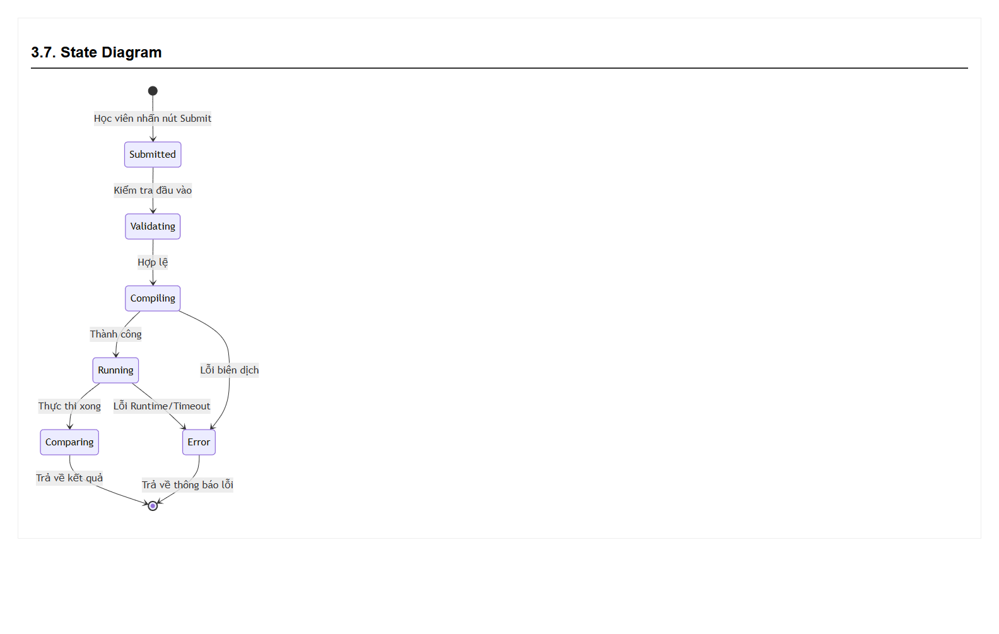

<!--
```mermaid
stateDiagram-v2
    [*] --> Submitted: Học viên nhấn nút Submit

    Submitted --> Validating: Kiểm tra đầu vào
    Validating --> Compiling: Hợp lệ
    Compiling --> Running: Thành công
    Compiling --> Error: Lỗi biên dịch
    Running --> Comparing: Thực thi xong
    Running --> Error: Lỗi Runtime/Timeout
    Comparing --> [*]: Trả về kết quả
    Error --> [*]: Trả về thông báo lỗi

````
-->

### 3.8. Đặc tả Use Case chi tiết

#### UC1: Chạy mã nguồn (Run Code)

- **Mô tả:** Học viên thực thi mã nguồn đang soạn thảo để kiểm tra logic với dữ liệu nhập tùy ý.
- **Tác nhân:** Học viên.
- **Luồng sự kiện chính:**
  1.  Học viên nhấn nút "Run".
  2.  Hệ thống khởi tạo phiên làm việc (SocketIO session).
  3.  Hệ thống tạo thư mục tạm và lưu mã nguồn vào tệp.
  4.  Hệ thống biên dịch (nếu cần) và thực thi mã nguồn.
  5.  Hệ thống chuyển tiếp đầu ra (stdout/stderr) về màn hình Console theo thời gian thực.
  6.  Học viên nhập liệu từ Console (nếu chương trình yêu cầu).
  7.  Hệ thống kết thúc phiên khi chương trình dừng.
- **Ngoại lệ:** Lỗi biên dịch (Compiler Error) hoặc Lỗi thực thi (Runtime Error) được hiển thị trực tiếp trên Console.

#### UC2: Nộp bài tập (Submit Solution)

- **Mô tả:** Học viên nộp bài để hệ thống chấm điểm dựa trên các bộ test case ẩn.
- **Tác nhân:** Học viên.
- **Luồng sự kiện chính:**
  1.  Học viên nhấn nút "Submit".
  2.  Hệ thống gửi mã nguồn lên Server qua API POST.
  3.  Server tải danh sách test case của bài tập từ cơ sở dữ liệu.
  4.  Với mỗi test case:
      - Hệ thống chạy mã nguồn với đầu vào (Input) của test case.
      - Hệ thống so sánh đầu ra thực tế với đầu ra mong đợi (Expected Output).
  5.  Hệ thống tổng hợp kết quả (Số lượng test case đạt/không đạt).
  6.  Hệ thống lưu kết quả vào lịch sử và trả về thông báo cho học viên.

#### UC3: Quản lý bài tập (Manage Problems - US05)

- **Mô tả:** Admin hoặc Giảng viên quản lý kho bài tập (thêm, sửa, xóa).
- **Tác nhân:** Admin/Giảng viên.
- **Luồng sự kiện chính:**
  1.  Tác nhân đăng nhập và truy cập trang quản lý bài tập.
  2.  Tác nhân chọn chức năng Thêm mới hoặc Chỉnh sửa bài tập.
  3.  Hệ thống hiển thị trình soạn thảo bài tập và cấu hình test case.
  4.  Tác nhân cập nhật thông tin và nhấn "Lưu".
  5.  Hệ thống xác thực và cập nhật vào `problems.json`.

#### UC4: Xem gợi ý và giải pháp (View Hint/Solution - US04)

- **Mô tả:** Học viên xem gợi ý hoặc mã nguồn mẫu để vượt qua thử thách.
- **Tác nhân:** Học viên.
- **Luồng sự kiện chính:**
  1.  Học viên nhấn nút "Xem gợi ý" hoặc "Xem lời giải".
  2.  Hệ thống truy xuất dữ liệu `hint` / `solution` từ DB.
  3.  Hệ thống hiển thị nội dung hỗ trợ cho học viên.

#### UC5: Quản lý nội dung khóa học (Course Content Management - US08, US09, US11)

- **Mô tả:** Giảng viên hoặc Trợ giảng quản lý bài giảng, tài liệu hoặc theo dõi sinh viên nộp bài.
- **Tác nhân:** Giảng viên, Trợ giảng.
- **Luồng sự kiện chính:**
  1.  Giảng viên/Trợ giảng truy cập Dashboard.
  2.  Hệ thống hiển thị tài liệu/bài nộp theo quyền hạn.
  3.  Giảng viên thực hiện chỉnh sửa, Trợ giảng thực hiện xem và đánh giá.
  4.  Hệ thống cập nhật trạng thái tương ứng.

#### UC6: Quản lý vai trò và phân quyền (Super Admin - US10)

- **Mô tả:** Quản trị viên cấp cao điều chỉnh các quyền hạn (Permissions) cho từng vai trò trong hệ thống.
- **Tác nhân:** Super Admin.
- **Luồng sự kiện chính:**
  1.  Super Admin đăng nhập vào trang Quản lý Vai trò.
  2.  Học chọn một vai trò (ví dụ: Admin, Instructor).
  3.  Hệ thống hiển thị danh sách các quyền hạn đang áp dụng.
  4.  Super Admin thêm/bớt quyền và nhấn "Cập nhật".
  5.  Hệ thống ghi nhận cấu hình mới vào `permissions.json`.

### 3.9. Sơ đồ tuần tự (Sequence Diagram)

#### 3.5.1. Sơ đồ tuần tự: Chạy mã nguồn (Thời gian thực)

![Sơ đồ tuần tự Chạy Code](images/seq_run.png)

<!--
```mermaid
sequenceDiagram
    participant H as Học viên
    participant UI as Browser (Ace Editor)
    participant S as Server (Flask/SocketIO)
    participant P as Subprocess (Compiler/Runner)

    H->>UI: Viết code & nhấn Run
    UI->>S: SocketIO emit 'start_session'
    S->>S: Tạo thư mục UUID & Lưu file
    alt Cần biên dịch (C/C++, Java)
        S->>P: Chạy lệnh biên dịch (gcc/javac)
        P-->>S: Kết quả biên dịch (Stdout/Stderr)
        S-->>UI: emit 'output' (nếu có lỗi)
    end
    S->>P: Popen thực thi chương trình
    loop Đọc luồng Output
        P->>S: Dữ liệu Stdout byte-by-byte
        S-->>UI: SocketIO emit 'output'
    end
    UI-->>H: Hiển thị Console
    opt Nhập dữ liệu (Stdin)
        H->>UI: Nhập dữ liệu
        UI->>S: emit 'send_input'
        S->>P: Nhập vào stdin của tiến trình
    end
    P-->>S: Kết thúc (Exit)
    S-->>UI: emit 'session_ended'
```
-->

#### 3.5.2. Sơ đồ tuần tự: Nộp bài tập (Chấm điểm tự động)

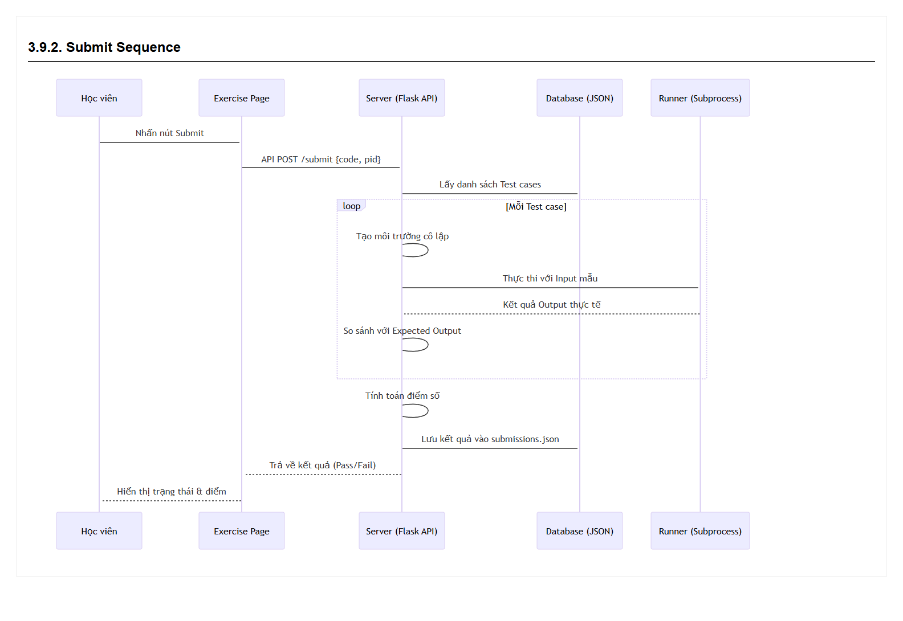

<!--
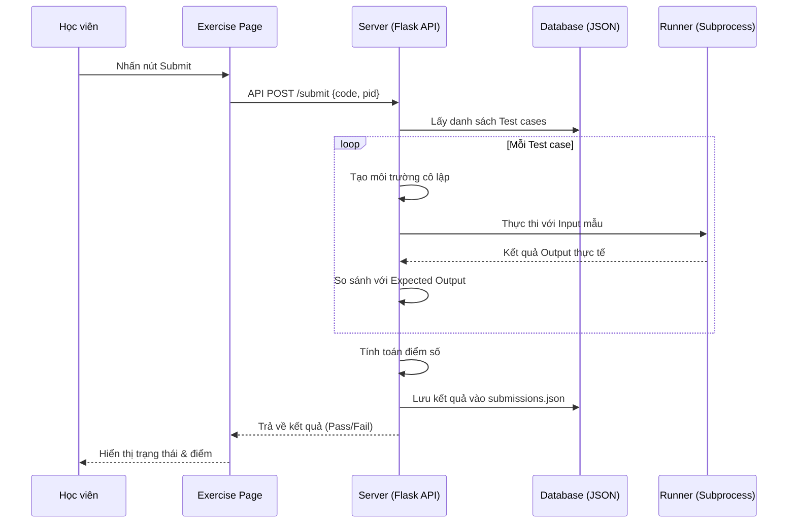
```mermaid
sequenceDiagram
    participant H as Học viên
    participant UI as Exercise Page
    participant S as Server (Flask API)
    participant D as Database (JSON)
    participant P as Runner (Subprocess)

    H->>UI: Nhấn nút Submit
    UI->>S: API POST /submit {code, pid}
    S->>D: Lấy danh sách Test cases
    loop Mỗi Test case
        S->>S: Tạo môi trường cô lập
        S->>P: Thực thi với Input mẫu
        P-->>S: Kết quả Output thực tế
        S->>S: So sánh với Expected Output
    end
    S->>S: Tính toán điểm số
    S->>D: Lưu kết quả vào submissions.json
    S-->>UI: Trả về kết quả (Pass/Fail)
    UI-->>H: Hiển thị trạng thái & điểm
```
-->

#### 3.5.3. Sơ đồ tuần tự: Quản lý bài tập (Admin/Instructor)

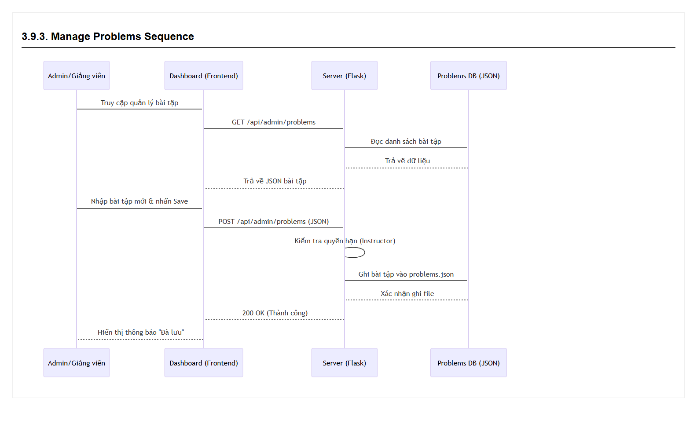

<!--
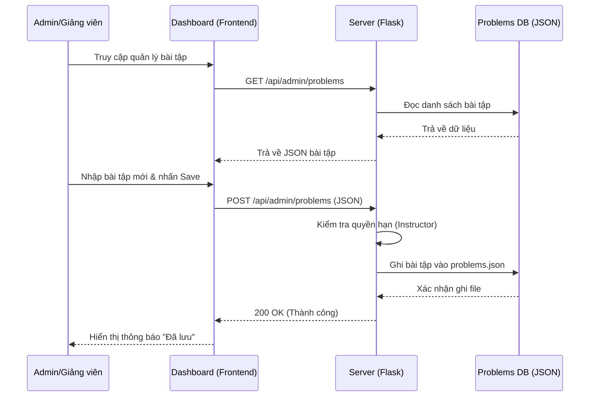
```mermaid
sequenceDiagram
    participant A as Admin/Giảng viên
    participant F as Dashboard (Frontend)
    participant S as Server (Flask)
    participant D as Problems DB (JSON)

    A->>F: Truy cập quản lý bài tập
    F->>S: GET /api/admin/problems
    S->>D: Đọc danh sách bài tập
    D-->>S: Trả về dữ liệu
    S-->>F: Trả về JSON bài tập
    A->>F: Nhập bài tập mới & nhấn Save
    F->>S: POST /api/admin/problems (JSON)
    S->>S: Kiểm tra quyền hạn (Instructor)
    S->>D: Ghi bài tập vào problems.json
    D-->>S: Xác nhận ghi file
    S-->>F: 200 OK (Thành công)
    F-->>A: Hiển thị thông báo "Đã lưu"
```
-->

#### 3.5.4. Sơ đồ tuần tự: Xem giải pháp/Gợi ý

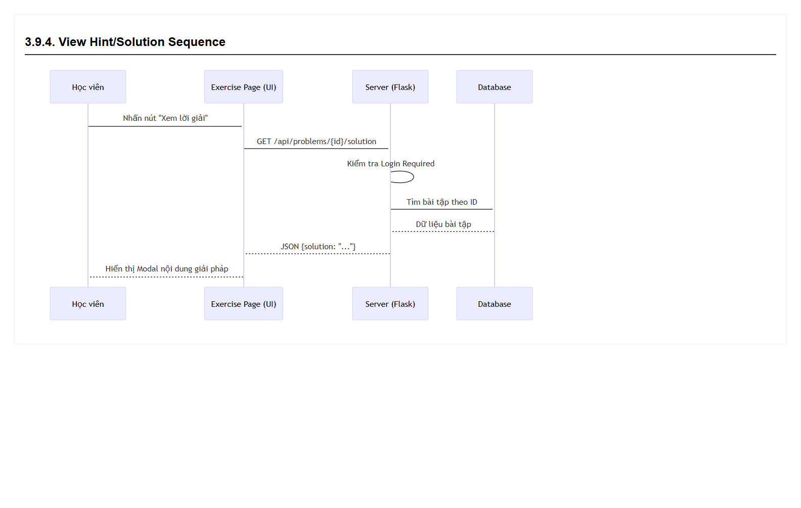

<!--
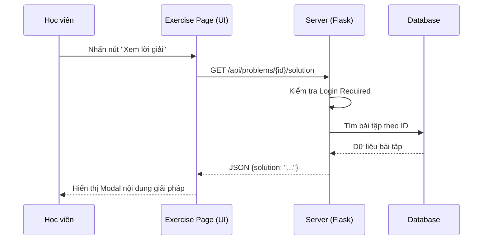
```mermaid
sequenceDiagram
    participant H as Học viên
    participant E as Exercise Page (UI)
    participant S as Server (Flask)
    participant D as Database

    H->>E: Nhấn nút "Xem lời giải"
    E->>S: GET /api/problems/{id}/solution
    S->>S: Kiểm tra Login Required
    S->>D: Tìm bài tập theo ID
    D-->>S: Dữ liệu bài tập
    S-->>E: JSON {solution: "..."}
    E-->>H: Hiển thị Modal nội dung giải pháp
```
-->

---

## 4. PHÂN TÍCH KỸ THUẬT

### 4.1. Công nghệ sử dụng (Technical Stack)

- **Backend:** Python (Flask framework), Flask-SocketIO (Thời gian thực).
- **Frontend:** HTML5, CSS3 (Vanilla), JavaScript, Socket.io client, Ace Editor.
- **Xử lý mã nguồn:** Subprocess (Popen) để biên dịch và thực thi code trực tiếp trên server.

### 4.2. Kiến trúc thư mục dự án

- `app.py`: Logic server chính, xử lý SocketIO và điều phối biên dịch.
- `problems.json`: Database chứa bài tập, test cases và solutions.
- `static/`: Chứa mã nguồn frontend (index.html, styles.css, script.js).
- `temp_sessions/`: Không gian cô lập để chạy file code của người dùng.

### 4.3. Sơ đồ luồng xử lý (Activity Diagram)

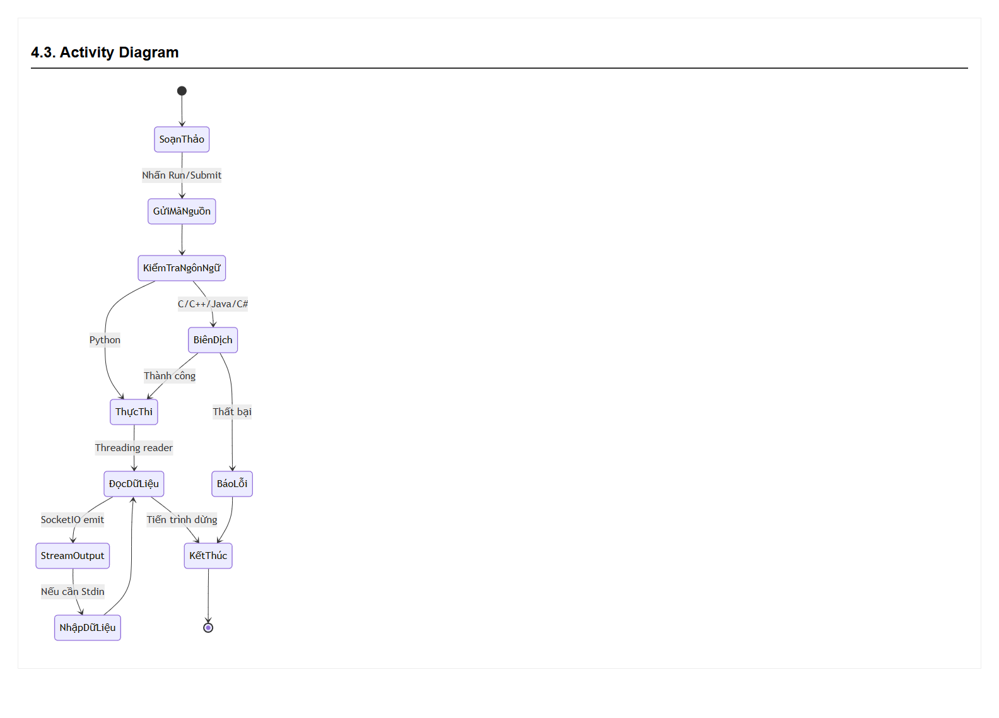

<!--
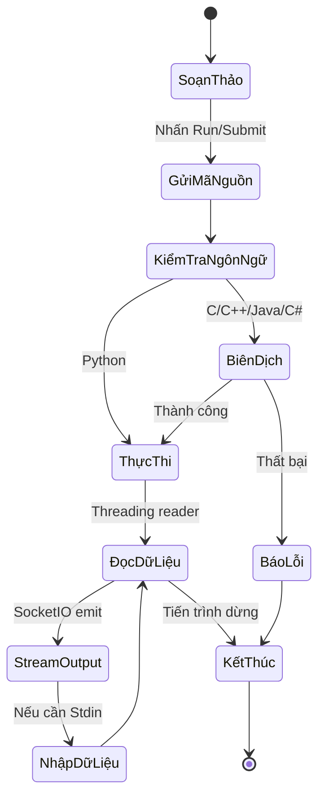
```mermaid
stateDiagram-v2
    [*] --> SoạnThảo
    SoạnThảo --> GửiMãNguồn: Nhấn Run/Submit
    GửiMãNguồn --> KiểmTraNgônNgữ
    KiểmTraNgônNgữ --> BiênDịch: C/C++/Java/C#
    KiểmTraNgônNgữ --> ThựcThi: Python
    BiênDịch --> ThựcThi: Thành công
    BiênDịch --> BáoLỗi: Thất bại
    ThựcThi --> ĐọcDữLiệu: Threading reader
    ĐọcDữLiệu --> StreamOutput: SocketIO emit
    StreamOutput --> NhậpDữLiệu: Nếu cần Stdin
    NhậpDữLiệu --> ĐọcDữLiệu
    ĐọcDữLiệu --> KếtThúc: Tiến trình dừng
    BáoLỗi --> KếtThúc
    KếtThúc --> [*]
```
-->

---

## 5. CÁC ĐIỂM NHẤN CÔNG NGHỆ

- **Tắt bộ đệm (No-Buffering):** Server tự động chèn mã `setvbuf` vào code C/C++ để người dùng thấy prompt (như "Nhập n:") ngay lập tức mà không cần đợi kết thúc dòng.
- **Tương tác thời gian thực:** Sử dụng Threading để đọc Output liên tục từ Subprocess, chuyển đổi sang Browser ngay khi có dữ liệu.
- **Bảo mật & Cô lập:** Chạy code trong thư mục tạm riêng biệt, giới hạn thời gian chạy (Timeout) để tránh treo tài nguyên.
- **Chấm điểm tự động:** Quy trình chấm điểm linh hoạt, chuẩn hóa output (normalize_text) để việc so sánh chính xác và khách quan.

---

## 6. KIẾN TRÚC HỆ THỐNG (SYSTEM ARCHITECTURE)

Hệ thống được thiết kế theo mô hình **Client-Server** với giao thức truyền tải hỗn hợp (HTTP/REST và WebSocket/SocketIO):

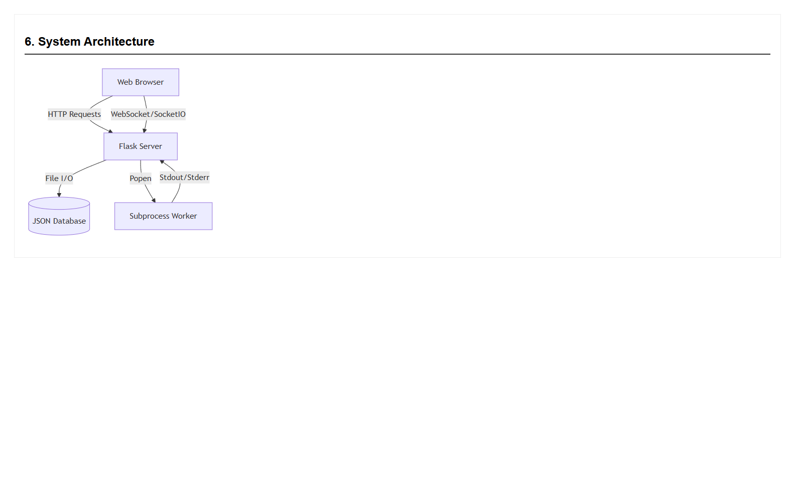

<!--
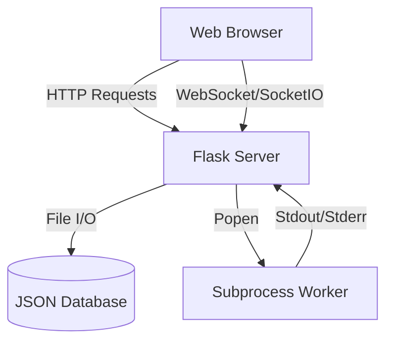
```mermaid
graph TD
    Client[Web Browser]
    Server[Flask Server]
    Worker[Subprocess Worker]
    DB[(JSON Database)]

    Client -- HTTP Requests --> Server
    Client -- WebSocket/SocketIO --> Server
    Server -- File I/O --> DB
    Server -- Popen --> Worker
    Worker -- Stdout/Stderr --> Server
```
-->

---

## 7. GIAO DIỆN HỆ THỐNG (GUI)

Để minh chứng cho tính hoàn thiện của sản phẩm, dưới đây là các hình ảnh thực tế từ ứng dụng đang vận hành:

### 7.1. Giao diện trang chủ và Danh sách bài tập

Học viên có thể dễ dàng tìm kiếm bài tập theo tên, phân loại theo cấp độ (Easy, Medium, Hard) hoặc theo chủ đề.

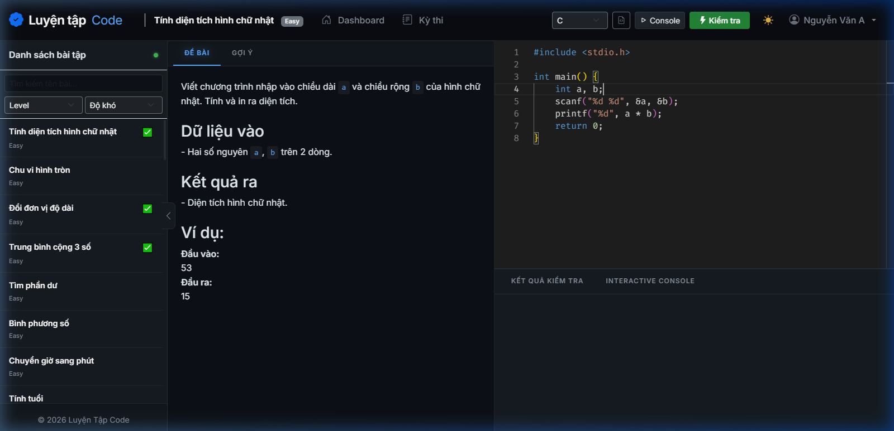

### 7.2. Trình soạn thảo mã nguồn (Coding Editor)

Tích hợp Ace Editor với đầy đủ tính năng: Syntax highlighting, tự động thụt lề, và hỗ trợ đa ngôn ngữ.

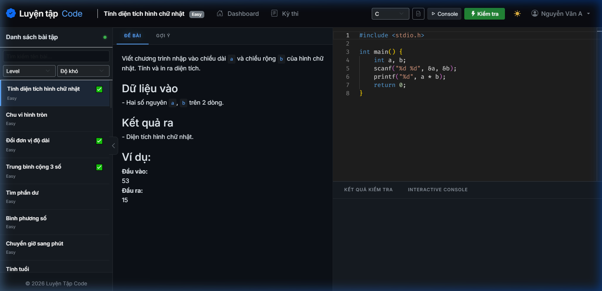

### 7.3. Kết quả thực thi thời gian thực

Hệ thống sử dụng SocketIO để truyền tải kết quả từ Server về Client ngay khi có dữ liệu, mang lại trải nghiệm tương tác mượt mà.

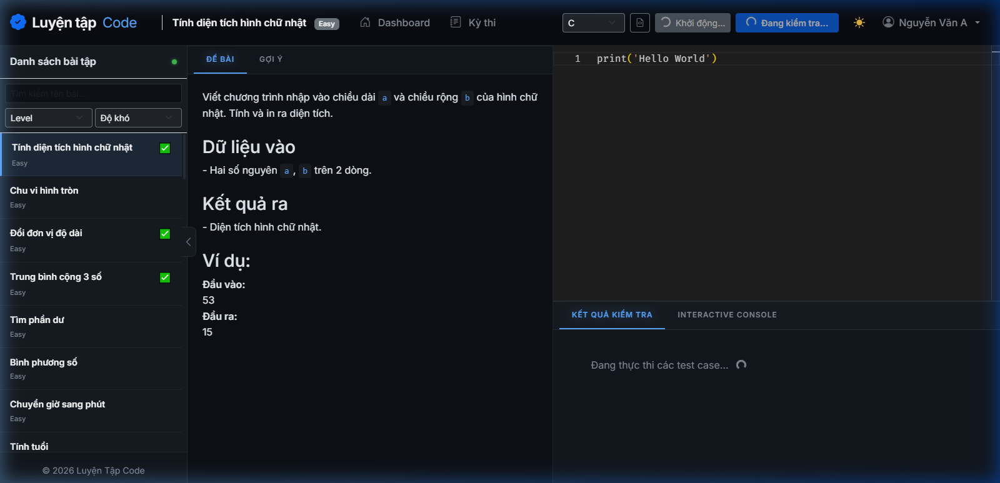

### 7.4. Quản lý bài tập (Dành cho Giảng viên)

Giao diện quản trị trực quan giúp Giảng viên dễ dàng thêm mới bài tập, cấu hình test cases và lời giải mẫu.

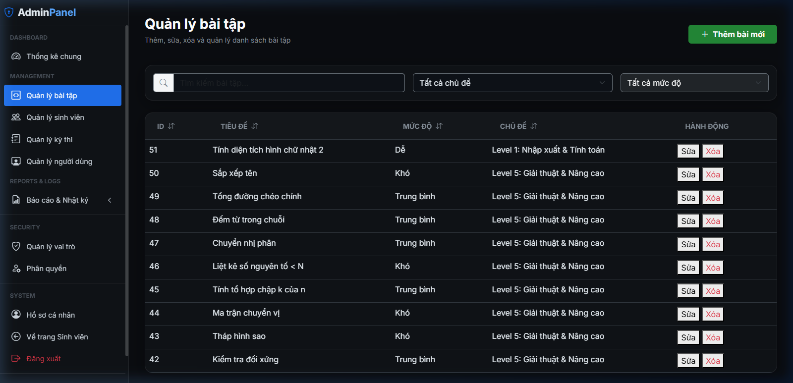

### 7.5. Bảng điều khiển Quản trị (Admin Dashboard)

Cung cấp cái nhìn tổng thể về hệ thống thông qua các biểu đồ thống kê: số lượng người dùng, tỷ lệ ngôn ngữ sử dụng, và hoạt động gần đây.

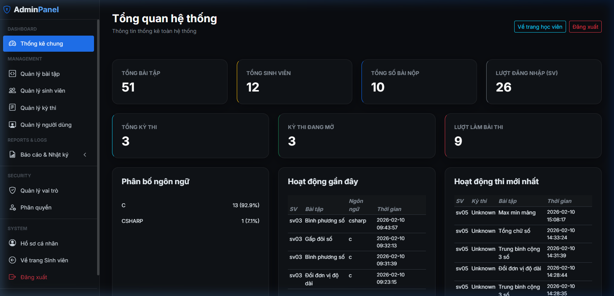

---

## 8. KẾT LUẬN

Chương trình **Luyện Tập Code** đã đáp ứng đầy đủ các tiêu chí của một ứng dụng quản lý và thực hành lập trình hiện đại. Hệ hệ thống không chỉ cung cấp nền tảng học tập mượt mà mà còn đảm bảo tính an toàn, bảo mật và khả năng mở rộng trong tương lai. Sự kết hợp giữa Flask, SocketIO và môi trường thực thi cô lập đã tạo nên một giải pháp học tập trực tuyến hiệu quả và chuyên nghiệp.
````
