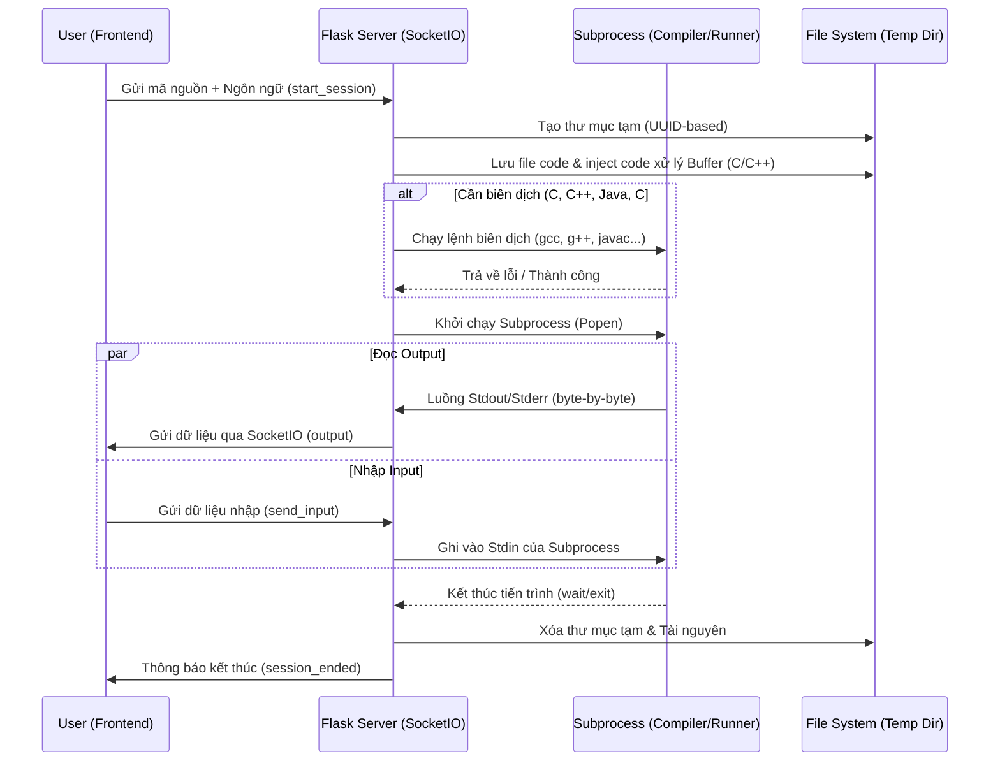

# BÁO CÁO CHI TIẾT CHƯƠNG TRÌNH "LUYỆN TẬP CODE"

## 1. Giới thiệu chung
Chương trình **Luyện Tập Code** là một nền tảng học tập trực tuyến (e-learning) được thiết kế để hỗ trợ người dùng thực hành lập trình với nhiều ngôn ngữ khác nhau. Hệ thống cung cấp một môi trường tương tác giúp người học giải quyết các bài toán từ cơ bản đến nâng cao, tự động kiểm tra kết quả và nhận phản hồi tức thì.

## 2. Công nghệ sử dụng (Technical Stack)
Chương trình được xây dựng trên mô hình Client-Server hiện đại:

*   **Backend:**
    *   **Ngôn ngữ:** Python (Flask framework).
    *   **Giao thức:** Flask-SocketIO (cho phép giao tiếp thời gian thực giữa server và trình duyệt).
    *   **Xử lý mã nguồn:** Sử dụng thư viện `subprocess` để biên dịch và chạy code trực tiếp trên tài nguyên máy chủ.
*   **Frontend:**
    *   **Giao diện:** HTML5, CSS3 (Vanilla CSS với phong cách thiết kế hiện đại, responsive).
    *   **Logic:** JavaScript (ES6+).
    *   **Thư viện hỗ trợ:** Socket.io client, Ace Editor (trình soạn thảo mã nguồn chuyên nghiệp).

## 3. Các tính năng chính
1.  **Trình soạn thảo mã nguồn tích hợp (Web-based IDE):** Hỗ trợ highlight cú pháp, tự động thụt đầu dòng cho nhiều ngôn ngữ.
2.  **Hỗ trợ đa ngôn ngữ:** Cho phép thực thi mã nguồn của Python, C, C++, Java, và C#.
3.  **Thực thi mã nguồn thời gian thực:** Nhờ công nghệ SocketIO, người dùng có thể nhập dữ liệu (stdin) và thấy kết quả (stdout) ngay lập tức khi đang chạy chương trình.
4.  **Hệ thống bài tập phong phú:**
    *   Chia làm 5 cấp độ (từ nhập xuất cơ bản đến giải thuật nâng cao).
    *   Mỗi bài tập đều có mô tả chi tiết, ví dụ (Input/Output), gợi ý (Hint) và mã nguồn mẫu (Solution Code).
5.  **Chấm điểm tự động (Auto-Testing):** Hệ thống tự động chạy code của người dùng với nhiều bộ test case khác nhau để kiểm tra tính chính xác.
6.  **Quản lý phiên làm việc (Session Management):** Mỗi lần chạy code được thực hiện trong một thư mục tạm riêng biệt để đảm bảo an toàn và không xung đột giữa các người dùng.

## 4. Cấu trúc mã nguồn (Project Structure)
- `app.py`: File thực thi chính của backend, xử lý logic server, biên dịch và điều phối luồng chạy chương trình.
- `generate_problems.py`: Script dùng để tạo và làm phong phú dữ liệu bài tập trong file `problems.json`.
- `problems.json`: Cơ sở dữ liệu chứa danh sách bài tập, test case và lời giải.
- `static/`: Chứa các tài nguyên frontend:
    - `index.html`: Giao diện người dùng chính.
    - `script.js`: Xử lý logic tương tác, kết nối SocketIO và điều khiển trình soạn thảo.
    - `styles.css`: Thiết kế giao diện mắt và tối ưu trải nghiệm người dùng.
- `temp_sessions/`: Thư mục lưu trữ tạm thời các file mã nguồn khi người dùng thực hiện chạy code.

## 5. Quy trình hoạt động (Workflow)
1.  **Người dùng chọn bài tập và ngôn ngữ:** Frontend tải dữ liệu từ `/problems`.
2.  **Viết code và nhấn "Run":** Code được gửi lên server qua SocketIO.
3.  **Server xử lý:**
    - Tạo thư mục tạm.
    - Lưu mã nguồn vào file.
    - Biên dịch (đối với C/C++/Java/C#).
    - Thực thi chương trình và chuyển tiếp luồng dữ liệu (stdout/stderr) về giao diện người dùng theo thời gian thực.
4.  **Chấm điểm (Submit):** Server chạy mã nguồn với các test case ẩn và trả về kết quả Đạt/Không đạt cho từng case.

## 7. Phân tích chuyên sâu luồng xử lý Backend

Phần này phân tích chi tiết cách thức Server xử lý mã nguồn của người dùng, từ lúc nhận code đến khi trả về kết quả thời gian thực.

### 7.1. Sơ đồ luồng xử lý (Workflow Diagram)

### 7.2. Các kỹ thuật đặc biệt trong Backend

#### A. Giải quyết vấn đề Buffering (C/C++)
Trong C/C++, đầu ra thường được lưu vào buffer trước khi in ra màn hình. Điều này khiến người dùng không thấy prompt (ví dụ: "Nhập n:") ngay lập tức. Server xử lý bằng cách **Inject mã nguồn khởi tạo**:
- **C:** Sử dụng `__attribute__((constructor))` để chạy hàm `setvbuf(stdout, NULL, _IONBF, 0)` ngay khi chương trình bắt đầu, tắt hoàn toàn bộ đệm.
- **C++:** Sử dụng một `static object` để gọi `std::ios::unitbuf`.

#### B. Xử lý Output thời gian thực (Real-time Streaming)
Để giao diện mượt mà như một Terminal thật, Backend sử dụng:
- **Threading:** Mỗi phiên chạy code có một thread riêng để đọc Output liên tục mà không làm treo Server.
- **Binary Read:** Đọc từng byte một (`stream.read(1)`) thay vì đọc từng dòng, giúp hiển thị dữ liệu ngay cả khi chương trình chưa kết thúc dòng (như các câu lệnh chờ nhập dữ liệu).

#### C. Quản lý tài nguyên và Bảo mật
- **Isolations:** Mỗi yêu cầu chạy code được thực thi trong một thư mục tạm độc lập (`temp_sessions/<session_id>`).
- **Timeout:** Giới hạn thời gian chạy tối đa (mặc định 60 giây) để tránh các chương trình bị lặp vô hạn gây treo tài nguyên máy chủ.
- **Auto-Cleanup:** Tự động dọn dẹp các thư mục tạm còn sót lại từ các phiên làm việc trước khi Server khởi động lại.

#### D. Chuẩn hóa Output trong Testing
Khi người dùng nhấn "Submit", hệ thống sử dụng hàm `normalize_text` để so sánh kết quả:
- Loại bỏ khoảng trắng dư thừa ở đầu/cuối mỗi dòng.
- Loại bỏ các dòng trống.
- Đồng nhất các ký tự xuống dòng (`\n`, `\r\n`).
- Việc này giúp quá trình chấm điểm công bằng hơn, không bị lỗi do những sai sót nhỏ về định dạng trình bày.

## 8. Kết luận
Chương trình "Luyện Tập Code" là một giải pháp hoàn chỉnh cho việc tự học lập trình. Với kiến trúc backend xử lý thông minh, khả năng tương tác thời gian thực và hệ thống tự động chấm điểm chính xác, dự án mang lại trải nghiệm học tập hiện đại, mượt mà và an toàn cho người dùng.
